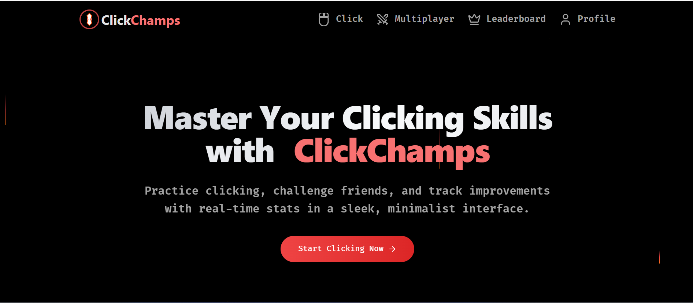

# ClickChamps

 

ClickChamps is a real-time multiplayer gaming platform designed to test and improve your clicking skills. Compete in various difficulty levels (Easy, Medium, Hard), track your performance, and climb the leaderboard to prove your skills against friends and other players worldwide.

---

---

## 🖼️ Demo Screenshot

Here’s a preview of the ClickChamps front page:



---

## 🧩 Overview

ClickChamps is a gamified platform that allows users to participate in real-time clicking challenges. Whether you're competing with friends or challenging random players globally, ClickChamps provides an engaging experience with detailed performance stats, leaderboards, and personalized user profiles.

---

## ✨ Features

- **Real-Time Multiplayer Gaming**: Compete in live click races against friends or other players worldwide.
- **Skill Levels**: Choose from three difficulty modes:
  - **Easy Level**: Perfect for beginners.
  - **Medium Level**: A moderate challenge for intermediate players.
  - **Hard Level**: Push your limits with advanced challenges.
- **Leaderboard**: Track your ranking and compete for the top spot on the global leaderboard.
- **User Profile Dashboard**: View detailed stats such as:
  - Average Score
  - Target Efficiency (%)
  - Tests Completed
  - All-Time Best Scores
  - Recent Performance Trends
- **Responsive Design**: Optimized for both desktop and mobile devices.
- **Customizable Game Modes**: Create or join rooms with custom settings.

---

## 🛠️ Tech Stack

### Frontend
- **React.js** – For building a dynamic and responsive UI
- **Vite** – Fast build tool for modern development
- **Tailwind CSS** – Utility-first CSS framework
- **Socket.IO Client** – Real-time communication

### Backend
- **Flask** – Lightweight Python framework
- **Flask-SocketIO** – Real-time WebSocket support
- **MongoDB** – NoSQL database

### Animations & Effects
- **Typed.js** – Typing text animations
- **Counter Effect** – Dynamic score animations
- **SVG Animations** – For visual appeal

---

## ⚙️ Installation & Setup

### Prerequisites

- **Node.js**: [Download & Install](https://nodejs.org/)
- **Python 3.x**: [Download & Install](https://www.python.org/)
- **MongoDB**: Local or MongoDB Atlas instance

### Steps

#### 1. Clone the Repository

```bash
git clone https://github.com/your-username/clickchamps.git
cd clickchamps
```

#### 2. Set Up Backend

```bash
cd backend

pip install -r requirements.txt

python run.py
```

#### 3. Set Up Frontend

```bash
cd ../frontend

npm install

npm run dev

```

#### 🕹️ Usage
1. Sign Up / Log In

Create an account or log in to access the platform.

2. Multiplayer Arena

Create Room: Select a difficulty level and create a room.

Join Room: Enter a game ID to join an existing room.

3. Play the Game

Once the game starts, click as accurately and efficiently as possible to achieve the highest score.

4. View Results

After the game ends, view your results and compare them with other players.

5. Profile Dashboard

Access your profile to view detailed stats, all-time best scores, and recent performance trends.

📡 API Endpoints
🔐 Authentication

POST /auth/register – Register a new user

POST /auth/login – Log in an existing user

🎮 Game

POST /game/create – Create a new game room

POST /game/join – Join an existing game room

POST /game/start – Start the game for all players

POST /game/update_stats – Update player stats during game

POST /game/submit_result – Submit final results after game

🏆 Leaderboard

GET /leaderboard/top10 – Fetch top 10 global players

👤 Profile

GET /profile/data – Fetch user profile data